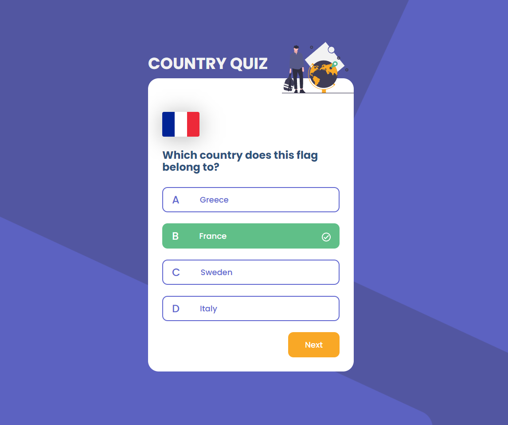

<!-- Please update value in the {}  -->

<h1 align="center">Country Quiz</h1>

<div align="center">
   Solution for a challenge from  <a href="http://devchallenges.io" target="_blank">Devchallenges.io</a>.
</div>

<div align="center">
  <h3>
    <a href="https://devchallenges-country-quiz.netlify.app/">
      Demo
    </a>
    <span> | </span>
    <a href="https://github.com/antoineterny/devchallenges-country-quiz">
      Solution
    </a>
    <span> | </span>
    <a href="https://devchallenges.io/challenges/Bu3G2irnaXmfwQ8sZkw8">
      Challenge
    </a>
  </h3>
</div>

<!-- TABLE OF CONTENTS -->

## Table of Contents

- [Overview](#overview)
  - [Built With](#built-with)
- [Features](#features)
- [How to use](#how-to-use)
- [Contact](#contact)
- [Acknowledgements](#acknowledgements)

<!-- OVERVIEW -->

## Overview

[](https://devchallenges-country-quiz.netlify.app/)

At first glance I thought this project was about API requests, in fact it was much more about game logic.
If I had to do it again it would be much different, now that I have the big picture.   
Anyway I had fun playing with this game so I build a configuration page to make it challenging and learn new things about the world, hope it will be the same for you!

### Built With

<!-- This section should list any major frameworks that you built your project using. Here are a few examples.-->

- [React](https://reactjs.org/)

## Features

<!-- List the features of your application or follow the template. Don't share the figma file here :) -->

This application/site was created as a submission to a [DevChallenges](https://devchallenges.io/challenges) challenge. The [challenge](https://devchallenges.io/challenges/Bu3G2irnaXmfwQ8sZkw8) was to build an application to complete the given user stories.

## How To Use

<!-- Example: -->

To clone and run this application, you'll need [Git](https://git-scm.com) and [Node.js](https://nodejs.org/en/download/) (which comes with [npm](http://npmjs.com)) installed on your computer. From your command line:

```bash
# Clone this repository
$ git clone https://github.com/antoineterny/devchallenges-country-quiz

# Install dependencies
$ npm install

# Run the app
$ npm start
```

## Acknowledgements

<!-- This section should list any articles or add-ons/plugins that helps you to complete the project. This is optional but it will help you in the future. For example: -->

- [Fisher–Yates Shuffle](https://bost.ocks.org/mike/shuffle/)  
to shuffle the countries array before asking questions. Not as easy as it seems...


## Contact

- Website [antoineteny.com](https://antoineterny.com/)
- GitHub [@antoineterny](https://github.com/antoineterny/)
